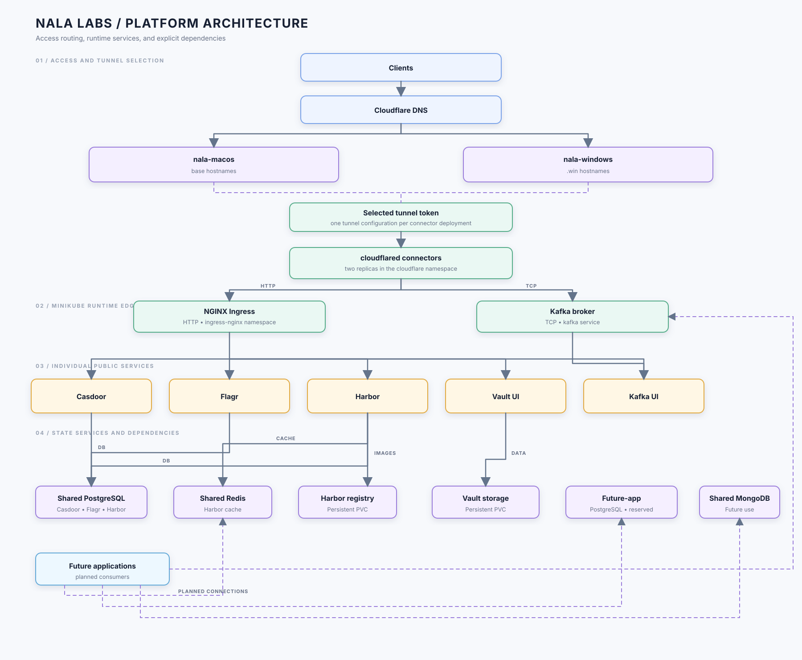

# Nala Labs Platform Architecture

This describes the infrastructure created by
`scripts/install.sh`. The default Kubernetes namespace is `nala-labs`;
Cloudflare Tunnel connectors run in `cloudflare`; Minikube's ingress add-on
runs in `ingress-nginx`.

## Overall diagram



Redis and Kafka are not HTTP services. Their UIs or HTTP APIs, where present,
use HTTPS through NGINX, while the Redis and Kafka brokers require separate
Cloudflare TCP routes. External clients need `cloudflared access tcp`;
applications inside the cluster should use the internal Kubernetes service
names.

## Namespaces and infrastructure

| Scope | Component | Description |
| --- | --- | --- |
| Minikube | Kubernetes cluster | Local development cluster hosting the platform |
| `ingress-nginx` | NGINX Ingress Controller | Receives HTTP traffic from cloudflared and selects services by hostname |
| `cloudflare` | cloudflared Deployment | Connector for the selected tunnel; Windows `auto` runs publish both base and `.win` hosts to `nala-windows`, while non-Windows `auto` runs publish base hosts to the selected non-Windows tunnel |
| `nala-labs` | Helm and application releases | Shared databases, messaging, identity, registry, feature flags, and secrets UI |

## Services and endpoints

### Public endpoints

| Service | Domain | Protocol | Purpose |
| --- | --- | --- | --- |
| Casdoor | `casdoor.nalanirvana.com`, `casdoor.win.nalanirvana.com` | HTTPS | Identity, SSO, OAuth/OIDC, and user management |
| Flagr | `flagr.nalanirvana.com`, `flagr.win.nalanirvana.com` | HTTPS | Feature flag evaluation and management API |
| Harbor | `harbor.nalanirvana.com`, `harbor.win.nalanirvana.com` | HTTPS | Container registry and artifact management |
| Vault | `vault.nalanirvana.com`, `vault.win.nalanirvana.com` | HTTPS | Persistent Vault UI and API |
| Kafka UI | `kafka-ui.nalanirvana.com`, `kafka-ui.win.nalanirvana.com` | HTTPS | Kafka topics, consumer groups, and message inspection |
| Redis | `redis.nalanirvana.com`, `redis.win.nalanirvana.com` | TCP | External Redis client route through Cloudflare Access/Tunnel when provisioned |
| Kafka | `kafka.nalanirvana.com`, `kafka.win.nalanirvana.com` | TCP | External Kafka client route through Cloudflare Access/Tunnel |

The installer automatically manages the DNS CNAME records for the selected
route scope when all Cloudflare API variables are supplied. Redis and Kafka
broker routes are TCP routes and are not created by an NGINX Ingress or by a
Kubernetes `ClusterIP` service alone; each needs a matching Cloudflare tunnel
route and DNS record. Kafka UI, Redis, and Vault are lab services and should be
protected with Cloudflare Access before external sharing. Standard Cloudflare
Universal SSL certificates do not cover nested hosts such as
`harbor.win.nalanirvana.com`; the zone needs edge certificate coverage for
`*.win.nalanirvana.com` before using the HTTPS aliases.

### Internal Kubernetes services

| Service | Kubernetes service | Port | Description |
| --- | --- | ---: | --- |
| Shared PostgreSQL | `postgresql.nala-labs.svc.cluster.local` | 5432 | Shared PostgreSQL for Casdoor, Flagr, and Harbor |
| Future-app PostgreSQL | `postgresql-app.nala-labs.svc.cluster.local` | 5432 | Reserved for future application development |
| MongoDB | `mongodb.nala-labs.svc.cluster.local` | 27017 | Shared MongoDB service for platform applications |
| Redis | `redis-master.nala-labs.svc.cluster.local` | 6379 | Shared Redis for cache, realtime fan-out, and queues |
| Kafka | `kafka.nala-labs.svc.cluster.local` | 9092 | Single-node KRaft event and message broker |
| Kafka UI | `kafka-ui.nala-labs.svc.cluster.local` | 80 | Web UI connected to the internal Kafka bootstrap address |
| Casdoor | `casdoor.nala-labs.svc.cluster.local` | 8000 | Identity service |
| Flagr | `flagr.nala-labs.svc.cluster.local` | 18000 | Feature flag service |
| Vault | `vault.nala-labs.svc.cluster.local` | 8200 | Vault HTTP API and UI |
| Harbor Core | `harbor-core.nala-labs.svc.cluster.local` | 80 | Harbor API and portal gateway |
| Harbor Registry | `harbor-registry.nala-labs.svc.cluster.local` | 5000 | OCI/Docker registry endpoint |

The exact Helm-generated Harbor service set can be checked with:

```bash
kubectl -n nala-labs get svc -l app=harbor
```

## Data and dependency relationships

- Casdoor and Flagr share the Bitnami PostgreSQL release but use separate
  databases: `casdoor` and `flagr`.
- Harbor uses the shared PostgreSQL and Redis releases; its registry storage
  remains a dedicated persistent volume.
- Kafka UI connects to Kafka using SASL/PLAIN over the internal service address.
- The shared Redis release is available to future platform applications for
  caching, notification fan-out, and background jobs.
- Vault runs in standalone mode with a persistent file backend and is
  initialized using `VAULT_ROOT_TOKEN`.
- PostgreSQL, MongoDB, Redis, Kafka, and Harbor persistence are enabled by the
  installer with local Minikube PVCs.

## Routing model

1. A public hostname resolves to the Cloudflare Tunnel CNAME.
2. Cloudflare sends the request to one of the two cloudflared pods.
3. HTTPS traffic is sent to
   `http://ingress-nginx-controller.ingress-nginx.svc.cluster.local:80`.
4. NGINX selects the backend using the HTTP Host header.
5. Redis and Kafka TCP traffic bypass HTTP ingress and are sent to
   `tcp://redis-master.nala-labs.svc.cluster.local:6379` and
   `tcp://kafka.nala-labs.svc.cluster.local:9092`, respectively.

Because both tunnel replicas run on the same Mac, they provide process-level
redundancy but not host-level availability. If the Mac, Docker, or Minikube is
offline, the public services are offline.

## Installer modules

The installation workflow is split into:

| File | Responsibility |
| --- | --- |
| `scripts/install.sh` | Entry point, temporary directory, lifecycle, and orchestration order |
| `scripts/lib/config.sh` | Environment defaults, release names, credentials, domains, and derived endpoints |
| `scripts/lib/common.sh` | kubectl/Helm wrappers and shared command helpers |
| `scripts/lib/values.sh` | Helm values generation and manifest rendering |
| `scripts/lib/cloudflare.sh` | Tunnel route/DNS automation, local connector cleanup, and public checks |
| `scripts/lib/platform.sh` | Minikube preparation, Helm installs, app deployment, Harbor handling, and summary |

## Useful inspection commands

```bash
kubectl -n nala-labs get pods -o wide
kubectl -n nala-labs get svc
kubectl -n nala-labs get ingress
kubectl -n cloudflare get pods
helm -n nala-labs list
```
