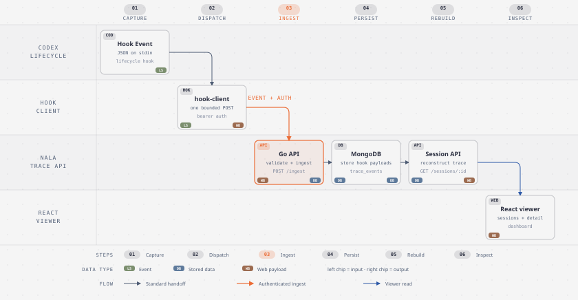

# Nala Trace

Nala Trace observes Codex sessions through Codex lifecycle hooks. A small
fire-and-forget hook client sends each captured event to a Go API, the API
stores events in MongoDB, and a React dashboard reconstructs sessions for
debugging and evaluation.

The hook client is deliberately outside Codex's success path. It performs one
bounded request, never prints event or credential data, swallows delivery
failures, and exits with status 0 so an observability outage cannot break a
Codex session.

## How it works



In short: Codex sends lifecycle JSON to `hook-client`, the client makes one
bounded authenticated request to the Go API, the API stores hook payloads in
MongoDB, and the React viewer reads reconstructed sessions through the API.

The repository manifest, [hooks.json](hooks.json), registers these lifecycle
events. Each command hook receives the lifecycle payload as JSON on stdin:

- `SessionStart`
- `UserPromptSubmit`
- `PreToolUse`
- `PostToolUse`
- `SubagentStart`
- `SubagentStop`
- `PreCompact`
- `PostCompact`
- `Stop`

The API reconstructs conversation messages, tool-call timelines, skill
evidence, and file-operation evidence from stored hook payloads. For terminal
events, the hook client also reads the bounded local `transcript_path` supplied
by Codex and copies the latest `token_count.info.total_token_usage` record and
the latest reasoning-effort setting into the payload before delivery. If that
transcript is unavailable, the event is still delivered without invented
usage or settings.

## Prerequisites

- Go 1.23 or newer
- Node.js and npm
- Docker, or another MongoDB 7-compatible deployment
- A Nala Labs API key for machine-to-machine hook delivery
- Access to the shared Nala Labs PostgreSQL `api_key` table for API-key validation
- Codex Desktop with hooks enabled

The default local addresses are:

| Service | Address |
| --- | --- |
| Nala Trace API | `http://127.0.0.1:3003` |
| React dashboard | `http://localhost:5005` |
| Nala Labs auth API | `http://127.0.0.1:8080` |
| MongoDB | `mongodb://127.0.0.1:27017` |

## Run Nala Trace locally

### 1. Start MongoDB

Use the repository's local MongoDB default, or point `MONGO_URI` at an existing
MongoDB deployment:

```bash
docker run -d --name codex-trace-mongo -p 27017:27017 mongo:7
```

### 2. Configure and start the Go API

Copy the non-secret example to the ignored local configuration file. Supply
secret values through the configured secret store; never commit them to
`backend/.env` or this README.

```bash
cp backend/.env.example backend/.env
cd backend
go run .
```

The API reads `backend/.env` when started from `backend/`. If Vault is not part
of the local run, remove or unset `VAULT_ADDR` so Vault loading is not
activated. If Vault, PostgreSQL, or Nala Labs authentication is enabled, use
the real configured services and credentials for that environment.

Check liveness from another terminal:

```bash
curl --fail-with-body --silent --show-error http://127.0.0.1:3003/healthz
```

`/healthz` reports the configured dependency status. Protected routes are:

- `POST /ingest` — accept one authenticated Codex hook event.
- `GET /sessions` — list owner-scoped session summaries.
- `GET /sessions/:id` — read one reconstructed owner-scoped trace.

Session summaries expose a `token_usage` object with `input_tokens`,
`cached_input_tokens`, `output_tokens`, `reasoning_tokens`, `total_tokens`,
The hook client obtains cumulative token
counts from Codex transcript `token_count` records on `Stop` and
`SubagentStop` events when available. The session trace also includes
`token_usage` on timeline events whose retained payload contains usage
evidence; the trace summary totals direct per-event usage or uses the latest
cumulative transcript snapshot once. Missing producer fields remain zero in
the API aggregate. Pricing is outside the token-usage contract because the
producer does not provide an authoritative price and Nala Trace does not
infer one.

Protected requests accept either of these Nala Labs credentials:

- `Authorization: Bearer <application-session JWT>` — Nala Trace forwards the
  JWT to Nala Labs `GET /api/auth/session` for validation and identity claims.
- `X-Nala-Labs-API-Key: <API key>` — Nala Trace hashes the key and resolves its
  owner from the shared PostgreSQL `api_key` table.

The hook client uses the API-key path and sends `CODEX_TRACE_API_TOKEN` as
`X-Nala-Labs-API-Key`. The Nala Labs authentication service is needed to issue
or revoke keys and to validate session JWTs; it is not contacted for each
API-key request.

### 3. Start the React dashboard

In a second terminal:

```bash
cd frontend
npm install
npm run dev
```

Open `http://localhost:5005`. The frontend is a separate process; Vite proxies
API paths to the Go API during development. Sign in through the configured
Nala Labs flow, open **Sessions**, and select a row to inspect its conversation,
tool calls, skills, and file evidence.

## Install the Codex hook

The checked-in `hooks.json` is the portable Codex hook manifest. It contains
the event registrations and the project-relative `.codex/hook-client.exe`
command, but no URL, token, or other secret.
The command is resolved from the current project directory, so hook delivery
does not depend on Codex inheriting a user or system PATH entry. Codex expects
each event to contain matcher groups with nested command handlers; do not add a
`version`, `known_gaps`, or `stdin` field.

### 1. Build the hook client

From the repository root:

```bash
cd backend
mkdir -p bin
go build -o bin/hook-client.exe ./cmd/hook-client
test -x bin/hook-client.exe
```

The final command must report exit status `0`. The installer copies this
binary into the target project's `.codex` directory; no PATH update is
required.

### 2. Set runtime configuration

Run the installer from Git Bash or another Bash shell. By default it installs
into the current working directory; use `--project-root` to install into a
different repository. It prompts only for the ingest URL and API key, builds
the hook client, and writes the key to the ignored project config file without
printing it:

```bash
bash scripts/install-hook.sh
# Or, from the Nala Trace checkout, install into another project:
bash scripts/install-hook.sh --project-root /path/to/other-project
```

The installer creates these files inside the target project:

- `.codex/nala-trace.env` — local URL, API key, and timeout.
- `.codex/hooks.json` — copied manifest with the project-relative client path.
- `.codex/hook-client.exe` — the built client executable.

Add `.codex` to the target project's ignore rules before committing. The
config contents are:

```text
CODEX_TRACE_API_URL=http://127.0.0.1:3003/ingest
CODEX_TRACE_API_TOKEN=<your Nala Labs API key>
CODEX_TRACE_API_TIMEOUT=2s
```

The hook client loads this file for every invocation, so new Codex chats in
this project do not depend on a long-lived Codex process inheriting environment
values. Keep the file user-readable only and never commit it. The hook client
sends the key in `X-Nala-Labs-API-Key`; raw Casdoor provider credentials are not
part of this application contract. Explicit process environment values still
override file values when supplied.

Configuration precedence is:

1. Explicit `CODEX_TRACE_*` process environment values.
2. `CODEX_TRACE_CONFIG_FILE`, when set.
3. `.codex/nala-trace.env` in the hook process's current project directory.
4. `%USERPROFILE%\\.codex\\nala-trace.env` on Windows or
   `$HOME/.codex/nala-trace.env` on macOS/Linux.

The user-level file is an optional cross-project fallback. Use the project
file for repository-specific credentials and the user file when the same
configuration should apply to projects that do not have a local file.

### 3. Install and trust the manifest

The installer already copies the repository manifest to `.codex/hooks.json` in
the target project. Use the Codex hook configuration flow from that project:

```text
codex
/hooks
```

When Codex asks to approve the hook, review that it invokes
`.codex/hook-client.exe` from the project directory, receives JSON on stdin,
and does not contain embedded credentials. Trust the command only after that
review. Keep all nine event registrations. JSON stdin is part of Codex
command-hook behavior and is not a field in `hooks.json`.

### 4. Generate and inspect a real trace

Start a normal Codex session after the hook is trusted. The hook client will
receive each supported lifecycle event automatically. On terminal events it
reads the local transcript usage record when available, then sends one bounded
`POST /ingest`, ignores the response body, and returns zero whether delivery
succeeds or fails.

After the session completes, inspect the API using the same API key:

```bash
export API_BASE_URL="http://127.0.0.1:3003"
curl --fail-with-body --silent --show-error \
  --header "X-Nala-Labs-API-Key: $CODEX_TRACE_API_TOKEN" \
  "$API_BASE_URL/sessions?limit=10"
```

Find the new session in the response, then open the dashboard and select it.
If the session is missing, check `/healthz`, the API logs, the hook executable
PATH, the process environment inherited by Codex, and the configured Nala
Labs authority. A successful Codex command alone does not prove that the
event was stored.

## Day-to-day usage

1. Start the API, dashboard, and their configured dependencies.
2. Keep the trusted hook configuration and runtime environment available to
   Codex Desktop.
3. Use Codex normally. Nala Trace records supported lifecycle events in the
   background.
4. Open the dashboard's **Sessions** view and select a session.
5. Read the reconstructed conversation, expand tool calls, and inspect skill
   and file-operation evidence while investigating a trace.
6. Use the protected API endpoints when automating session-list or trace-detail
   checks from a trusted environment.

## Known limitations

- Hook delivery is best effort. The hook client always exits 0, including when
  configuration is missing, the API is unavailable, the response is non-2xx,
  or the request times out. This protects Codex but can result in a missing
  trace.
- `unified_exec` and `WebSearch` are documented coverage gaps. A missing hook
  event for either path is not proof that the underlying tool was not used.
- Hook event reconstruction is evidence-based and conservative. Ambiguous
  skill or file activity is not presented as certain activity.
- The frontend uses hash navigation for session details, for example
  `http://localhost:5005/#/sessions/<id>`.

## Development checks

Run the repository checks from the root:

```bash
make verify
```

Run the test suites independently when changing implementation code:

```bash
cd backend
go test ./...

cd ../frontend
npm test
```

Keep credentials, local `.env` files, `.vault-config` files, API tokens, and
generated artifacts out of commits.
